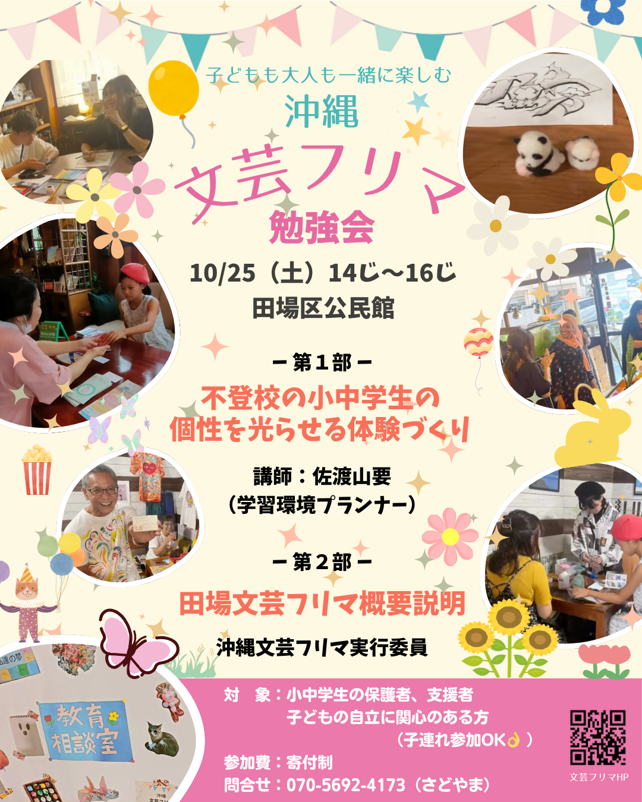
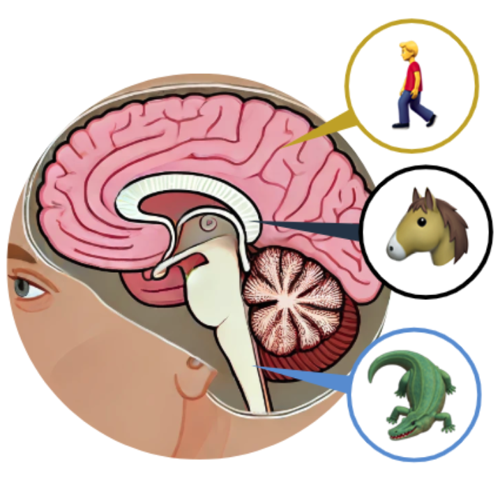
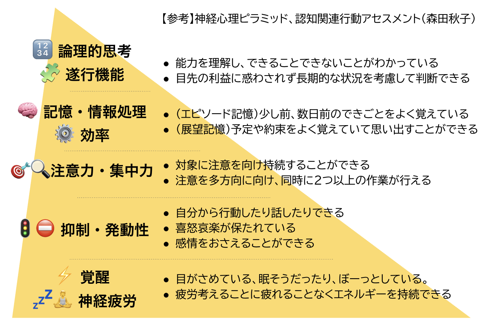
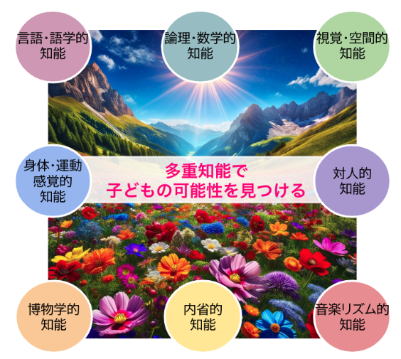

# 🏫 銘苅小PTCA 子育て勉強会
## 〜子どもの“得意”が輝くきっかけとは？〜

📅 2025年11月1日（金）  
📍 銘苅小学校  
👨‍👩‍👧‍👦 対象：保護者・教職員・地域の支援者

---

# 🎯 今日の目的

- 子どもの「困った行動」の背景にあるメカニズムを知る  
- 多様な“得意”や“賢さ”に気づく視点をもつ  
- 「どこで伸びるか？」を行事で見立ててみる  
- 11月の**産業教育フェア**を“体験のチャンス”に変える

---

# ① 導入ワーク

### ✏️「最近、子どものことで気になること」

- 怒る・泣く・動かない
- 朝起きない、やる気がない
- 集中できない、落ち着きがない

→ グループで2人1組 or 3人組で共有（3分）

---

# ② 🧠 子どもの行動は脳からくる？

## 3層の脳構造

| 脳の層 | 働き | 子どもの行動 |
|--|--|--|
| 🐊 爬虫類脳 | 生き残る | 黙る・固まる・逃げる |
| 🐶 哺乳類脳 | 感情反応 | 泣く・怒る・不安 |
| 🧠 人間脳 | 理解・選択 | 考える・話す・調整する |

> ❗️大人が「指示」しても届いてないかも？  
> → まず“安全”と“安心”が必要

---

# 🧱 神経心理ピラミッド

| 層 | 機能 | 例 |
|---|---|---|
| 上層 | 学習・言語・計画 | 授業・会話 |
| 中層 | 感情・注意 | 落ち着く・集中 |
| 下層 | 安全・覚醒 | 起きてる・安心してる |

> 🎯「イライラしてる・そわそわしてる」ときは、学びにならない

---

# ③ エリクソンの発達課題

### 小中学生のテーマは「勤勉性 vs 劣等感」

- **「できた！」という経験を通して有能感が育つ**
- 「人と違うこと」は“苦手”ではなく“役割”
- 自分だけの“活きる場面”を見つけていく

---

# ④ 🌈 多重知能（MI）

### 「頭のよさはひとつじゃない」

| 知能 | 活きる場面例 |
|--|--|
| 言語 | 発表・話す・書く |
| 数理 | 考えて工夫する |
| 空間 | 図・イメージ・構成 |
| 身体 | 動く・つくる・実演 |
| 音楽 | リズム・音の工夫 |
| 対人 | 話し合い・まとめ |
| 内省 | ふり返り・目標 |
| 自然 | 生き物・季節・環境 |

---

# ⑤ ワーク1  
## 📝「うちの子、どこで光る？」

以下の中で、うちの子が得意そうなものを〇してみよう

- 💬 言葉で伝える  
- 🧮 考えて工夫する  
- 🎨 絵やレイアウトが得意  
- 🤸 身体で動く  
- 🎶 音やリズムを使う  
- 🤝 人と関わるのが好き  
- 🧘 自分で考えるのが得意  
- 🌿 自然や動物に興味がある  

→ となりの人と共有してみよう（2分）

---

# ⑥ ワーク2  
## 📅「学校行事でどこが光れそう？」

### 例：

- **運動会 → 身体的・対人的**  
- **図工展 → 空間的・内省的**  
- **合唱 → 音楽・対人・空間**  
- **委員会 → 言語・対人**  

> 💡 MI（多重知能）ごとに“輝く行事”が違う！

---

# 🌟特別紹介
## 🏭 11月14日（木）開催  
### 「沖縄県 産業教育フェア（美ら産フェア）」

- **高校生が本気で魅せる・つくる・売る**
- **子どもにとってロールモデルに！**
- **職業観・得意発見の大チャンス✨**

🚌 保護者も一緒に見に行ってみよう！

---

# 🎁 ふりかえり

- わが子の **「得意」「好き」** に新しい視点はあった？  
- 学校行事で「この子なら活きる」場面が見えた？  
- フェアや家庭で、どんな「応援」ができそう？

---

# 🌱 まとめ

### 私たち大人ができるのは  
「評価」ではなく「出会いの場」をつくること

> 🌈 子どもの多様な“賢さ”が活きる機会は  
> 意外とすぐそばにある

---

# 🙌 ありがとうございました！

一緒に「この子が活きる場所」を  
探していきましょう！

🎤 次は、長嶺政さんによる「ペップトーク」です！

---