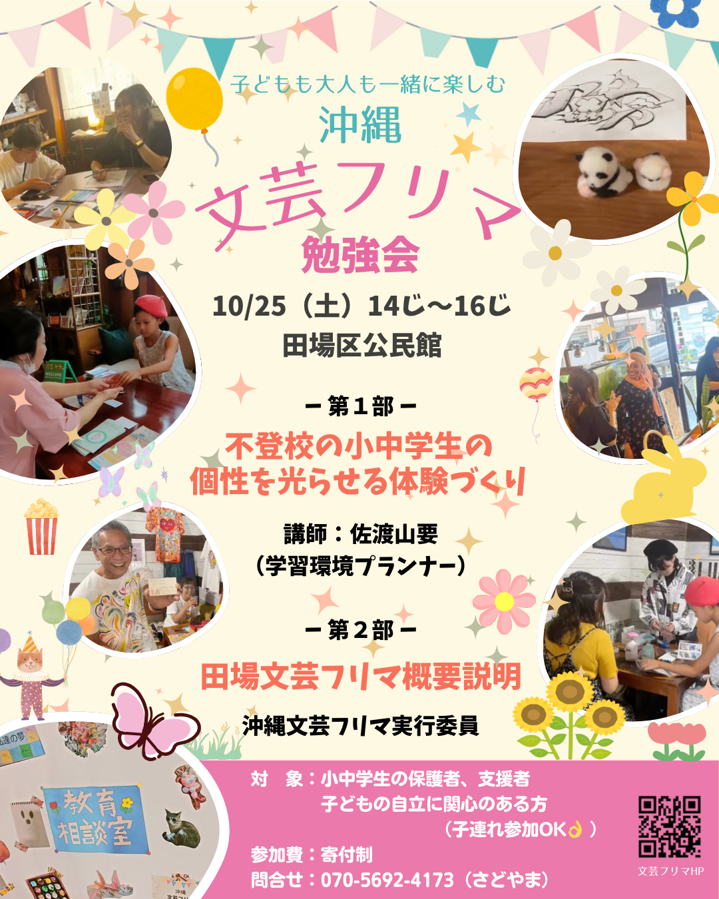
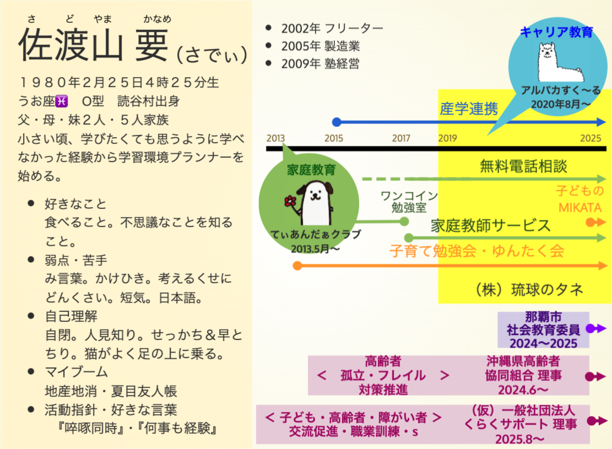
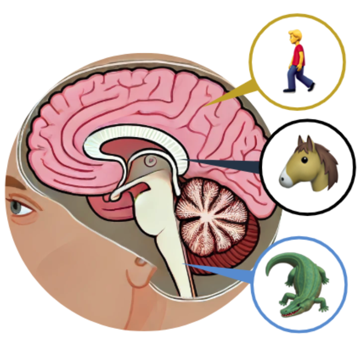
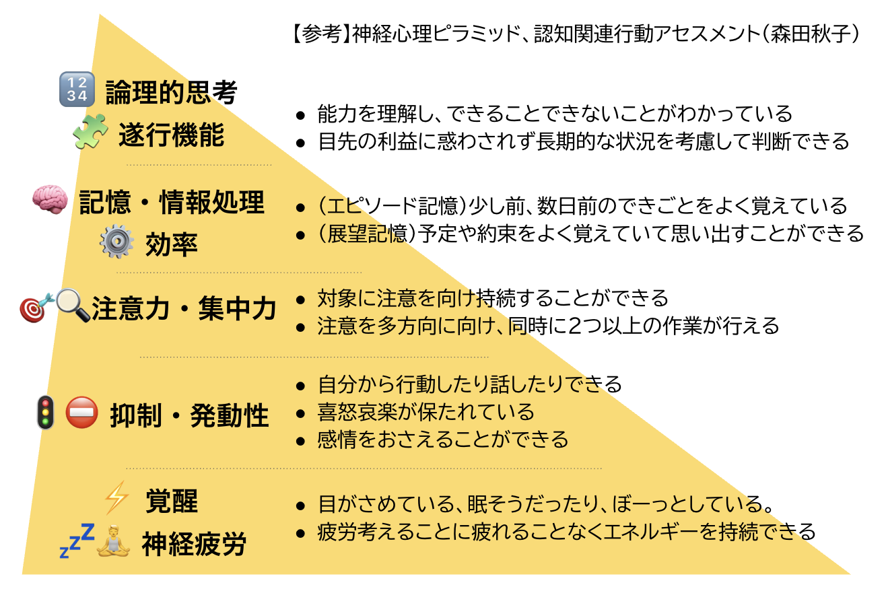
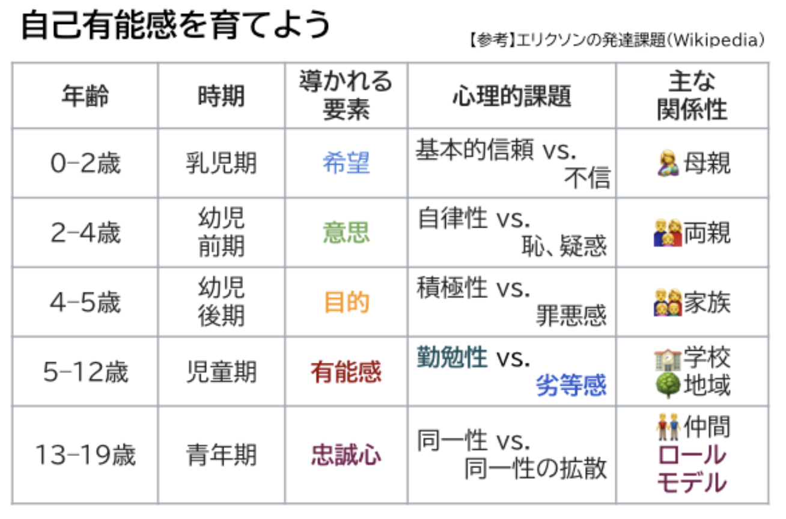
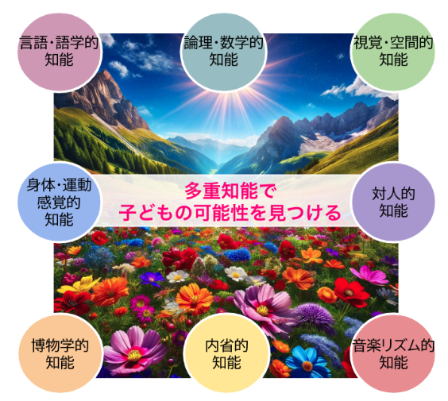
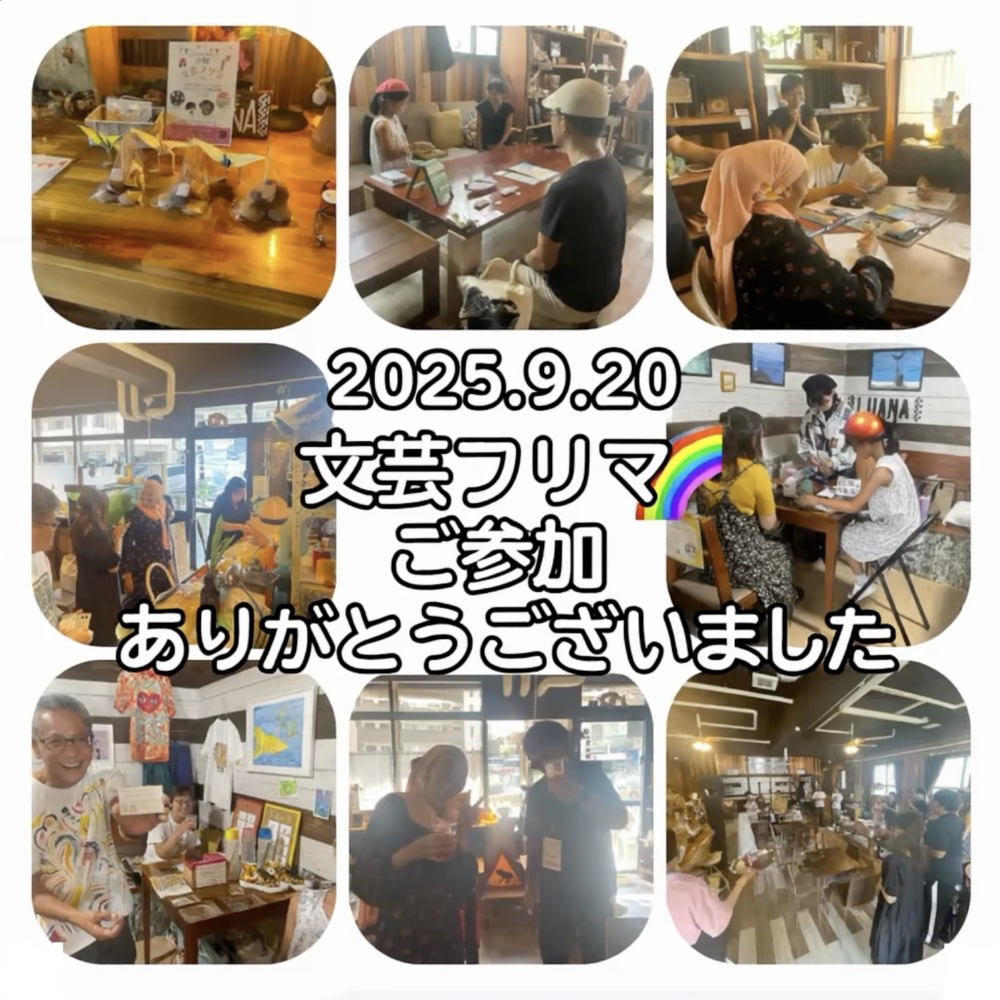

# 🌟沖縄文芸フリマ勉強会  　

🕒 2025年10月25日 14:00〜16:00
📍田場区公民館
👨‍👩‍👧‍👦 対象：小中学生の保護者、支援者 　　　　 子どもの自立に関心のある方  

<!-- 右側にチラシ画像-->

---

# 📋本日の流れ

   | 時間帯 | 内容 |
   |---|---|
   | <big>14:00〜14:45</big> | <big>一 第 1️⃣ 部 ー  不登校の小中学生の個性を光らせる体験づくり</big>  講師：佐渡山要（学習環境プランナー）   |
|<big>14:45〜15:00|<big>休憩|
   | <big>15:00〜15:45<big> | <big>ー 第 2️⃣ 部 ー 田場文芸フリマ概要説明</big> 沖縄文芸フリマ実行委員   |
   | <big>15:45〜16:00</big> | <big>まとめ</big> |

---

<!--

_header: ""
_footer: "" 
_backgroundColor: rgba(250, 246, 227, 1);

---> 指定したスライドのみに適用

### ⚫︎ 2025年度 対象者 (15世帯/年)

| 概要 | 小 学 | 中 学 | 高 校 | 成 人 |団 体|
| :--- | :--- | :--- | :--- | :--- |:--- |
|不登校 |O|O|  |  ||
|行き渋り |O|  |  |  ||
|非行 |  |O|  |  ||
|場面緘黙 |  |O|  |  ||
|社交不安|O|O|O|  ||
|職業訓練|  |  |O|O||
|読字障害|  |  |  |O||
|ｱﾝｶﾞｰﾏﾈｼﾞﾒﾝﾄ |  |O|  |O||
|キャリア教育 |||||O|

---

# 🎯今日の目的

 

- #### 子どもの【得意】と【やりたい】をつかむ方法を知る  

  

- #### 「見方」を加えて一緒に楽しむ「味方」（応援者）になる  

     

---

<!--

# ③ ミニ講座 1️⃣  
## 子どもの【得意】を見つけるワーク

 -->

<!-- _header: "理論レクチャー：子どもの背景を理解する" -->

# 🧠 子どもを理解する3つの見方

 

#### 見方① 脳のつくり（防衛と集中）
#### 見方② 心の発達段階（できる自分を育てる）
#### 見方③ 得意のチャンネル（多様な知能）

 

> ### プロフィールシートの言葉の「背景」に、
> ### こうした見方を持つと、見えてくるものが変わります。

---

<!-- _header: "脳の3層構造" -->

# 見方①
## 🧠 脳の3層構造

| 脳の層      | はたらき       | 子どもの行動の例       |
|:-------------|:------------|:----------------|
| 🚶‍♀️ 人間脳     | 考える        | 話す、学ぶ、工夫する   |
| 🐶 哺乳類脳     | 感情を感じる | 泣く、怒る、甘える     |
| 🐊 爬虫類脳     | 危険を避ける | 黙る、動けない、逃げる |

 

> ### 行動が止まるとき、それは「怠け」ではなく、  
> ### 「防衛モード」かもしれません。

  

---

<!-- _header: "神経心理ピラミッド" -->

# 見方①
## 🧱 神経心理ピラミッド

人の学びは“上の階”にあるけど、
その前に土台がある。

| 階層 | 内容 |
|------|------|
| 🧠 上層 | 勉強のような思考・言語・計画 |
| 💡 中層 | 注意・感情の安定 |
| 🔋 下層 | 抑圧・覚醒（起きてる／安全） |

> ### 土台がグラグラだと、 頂上も崩れちゃう！

---

<!-- _header: "エリクソンの発達段階" -->

# 見方②
## 🧠 エリクソンの発達課題

######  **皆ができて自分ができない事があるとき** 「自分ができなくても皆ができるからいいや、どうせ自分なんて」と諦めや劣等感を持ってしまいそうになる。
######  逆に、周りの皆ができなくて**自分にしかできない事がある**と「もっと自分にできる事はないかな？」と**自分にできる事（有能感）** を探していきます。
######  「有能感」は  **「根気」や「粘り強さ」** を 形成し、一生の価値があります。
######  「勤勉性」は「できた」とか「やりとげた」といった達成感のことです。

---

#### だからこそ私たち大人が、
#### この『できた』を経験できる場を

#### 意識的に用意してあげることが大切になる 

 

> ## 今回の、『田場文芸フリマ』がまさにその経験ができる場です

---

#### その『できた』っていう経験を

#### もっと実感させるために...

---

#### 多重知能理論をご紹介します。

---

<!-- _header: "多重知能理論（MI）" -->

# 見方③
##  🌈 多重知能理論（MI）

ハーバード大学のガードナー博士は人の“知能（賢さ）”は8つの分野に分かれていると提唱しています。

人は、それぞれ違う“得意のチャンネル”を持っています。 **得意を発見し、“その子らしい経験を提案する"** ことで、子どもは“安心して挑戦”できるようになります。

#### 📌 「どんな得意（賢さ）」があるだろう？

---

<!-- _header: "子どもの応援を楽しむ" -->

# ④ ミニ講座 2️⃣  
## 子どもの『できた』をつくるワーク

---

<!-- _header: "④ミニ講座２：応援を楽しむ" -->

#### 🎈 お題：子どもの『できた』を多重知能で応援するとしたら？

- ## 視覚空間：絵やイラストのチラシ
- ## 対人：お客さんを楽しませる
- ## 身体・運動：場を盛り上げる
- ## 論理・数学：混雑を解消する
- ## 音楽・リズム：雰囲気づくり

#### 💬 どんな声かけがある？  

---

<!-- _header: "まとめとふりかえり" -->

# ⑤ ふりかえり＆まとめ

#### 各グループから発表

---
# ー 第 2️⃣ 部 ー

## 文芸フリマ概要説明 
- ###   沖縄文芸フリマ実行委員 　　　　　平安座尚子さん
- ### 　公民館使用について⚠️  田場区自治会長　天願力 さん
- ### Q&A

---

# 明日からできる3つのステップ

 

#### ① 🧠 脳と心が安全だと感じられる環境を整える
 

#### ② 💬 子どもがやり遂げることをサポートしてあげる
 

#### ③ 🌈 その子ならではの強み・得意・賢さを生かすサポート

---

<!-- _header: "" -->
<!-- _footer: "" -->

# さいごに💐

 

## 私たち大人ができるのは、  “評価” することではなく ”ご縁をつなげる” こと。

#### 「その子の個性を光らせる体験との出会いはなんでしょう？」

## 子どもの味方となって、可能性に目を向けていきましょう🌱  ありがとうございました。

 琉球のタネ  ひとり一人の「好き」「得意」が社会とつながる

