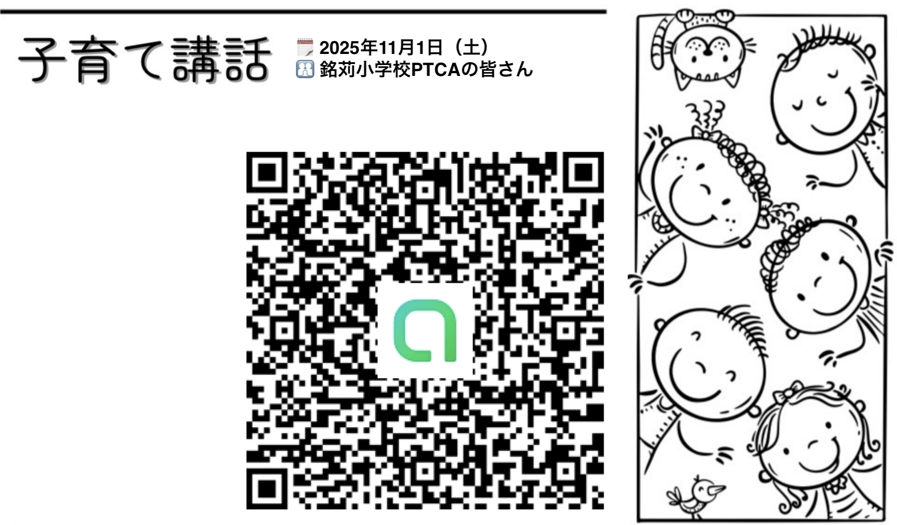
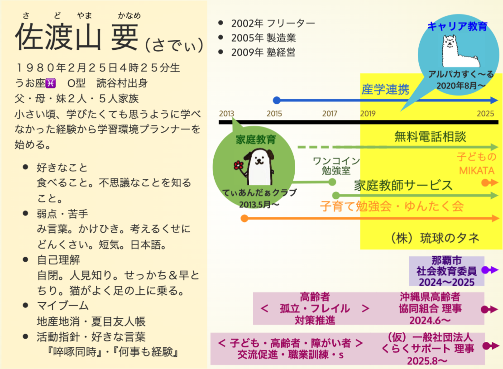

 

#### ご参加ありがとうございます🌈

 

### QRコードから オプチャにご参加頂くと、 あとからスマホに スライド画像が届きます。 👉

    

<!-- 右側にチラシ画像-->

---

# 📋 本日の流れ

| 時間帯 | 内容 |
|---|---|
| <big>9:30〜9:50</big> | <big>ー 前半 ー 子どものことを理解する</big>|
| <big>9:50〜10:20</big> | <big>ー 後半 ー 子どもの自信とやる気を育む</big> |
| <big>10:20〜10:30</big> | <big>まとめ・ふりかえり</big>

     

---
<!--

_header: ""
_footer: "" 
_backgroundColor: rgba(250, 246, 227, 1);

---> 指定したスライドのみに適用

### ⚫︎ 2025年度 対象者 (15世帯/年)

| 概要 | 小 学 | 中 学 | 高 校 | 成 人 |団 体|
| :--- | :--- | :--- | :--- | :--- |:--- |
|不登校 |O|O|  |  ||
|行き渋り |O|  |  |  ||
|非行 |  |O|  |  ||
|場面緘黙 |  |O|  |  ||
|社交不安|O|O|O|  ||
|職業訓練|  |  |O|O||
|読字障害|  |  |  |O||
|ｱﾝｶﾞｰﾏﾈｼﾞﾒﾝﾄ |  |O|  |O||
|キャリア教育 |||||O|

---

<!-- 
_header: ""
_footer: "" 
_backgroundColor: rgba(250, 246, 227, 1);

---> 指定したスライドのみに適用

# お願い
  
- ## 「専門知識」に関する質問は、 精神科医、臨床心理士（カウンセラー）、精神保健福祉士、特別支援教育士等にご相談されることをお勧めいたします。

- ## 今日は、「学習支援」「特別支援」に関連する項目について情報提供をいたします。それ以外については<strong>必要以上の情報を聞いて、不安にさせてしまう場合がある</strong>ので、個別での無料電話相談等をご利用ください。
                
                
- ## 配慮ある発言を心がけます。 もし、不適切な表現があった場合はご指摘をお願いいたします。

- ## 記録写真📸 を撮りますが、使用の際は顔を🌸などで隠します。 それでも写りたくない場合はお申し付けください。

- ## この場への参加者や質疑内容については、他言しないようご協力をお願い申し上げます。            

---

# 🎯今日の目的

#### ⚪︎子どものことを理解する

 

#### ⚪︎子どもの自信と 　　　　　やる気を育む

       

---

# 🎯今日の目的

#### ⚪︎子どものことを理解する
##### **【前半】**
- ### 「困った行動」の背景を一緒に考える
- ### 脳の仕組みを学ぶ 

#### ⚪︎子どもの自信と 　　　　　やる気を育む
##### **【後半】**

- ### 学びの環境づくりを知る

 

---

# 【前半】 子どもの「困った行動」    
#### どうしたらいい？

<!--
🎙️ 今日は、皆さんの日常のイライラを出発点にしながら、
子どもの行動の背景にある「脳の仕組み」や「神経心理ピラミッド」を、
体験とともに学んでいきます。
-->

---

## 🟠 グループワーク(5分)  
### 最近ちょっとイライラしたことありますか？

- 宿題しない
- 朝起きない
- 準備しない
- 兄弟げんかが止まらない

→ 入り口に近い人から順に、自己紹介も兼ねて、 **1人1分ずつ話してみましょう**

→ 話す方の左手側の人が、配られた用紙の左上に書き出してください

<!--
🎙️ ではまず、ウォーミングアップ。
最近、ちょっと「イライラしたなあ」と思った子どもの行動を
グループ内でシェアしてみましょう。
できる範囲でOKです。自己紹介もかねてどうぞ。
-->

---

# 🧠 脳のしくみ

| 脳の名前 | 機能 | 子育て場面での反応 |
|----------|---------------|------------------|
| 🚶‍♂️ 人間脳 | 考える・我慢 | 理性・言語・計画 |
| 🐴 哺乳類脳 | 感情・共感 | 不安・泣く・甘える |
| 🐊 爬虫類脳 | 危険の回避 | 警戒・イライラ・固まる |

-  ### 「イライラした」と言っていたのは、 爬虫類脳の反応
-  ### 話すことで、人間脳が整理し、共感してもらって、哺乳類脳が落ち着いた

<!--
🎙️ さっき皆さんが「イライラした」と言っていたのは、
爬虫類脳の反応です。
でも、こうして話すことで、人間脳が整理し、
共感してもらって、哺乳類脳が落ち着いたんです。
まさに脳を“実体験”しましたね。
-->

---

## 🧠 つまり脳って…

#### ① 感情が先に動く（本能）　🐊

#### ② 共感で落ち着く（安心）　🐴

#### ③ 言葉で整理できる（思考）　🚶‍♂️

 　

#### 📍 子どもは 　③の脳（人間脳）がまだ未熟 　です

<!--
🎙️ この順番がとても大事です。
まず“感情”が動く。子どもはそこに大人よりずっと左右されます。
「考える前に、もう嫌になってる」ってこと、ありますよね。
## 🧩 さらに脳の中では…

### 子どもは「行動する前」に  
たくさんの準備が必要です！

-->

---

# 🧠 脳のしくみ
## 🧱 神経心理ピラミッド

人の学びは“上の階”にあるけど、
その前に土台がある。

| 階層 | 内容 |
|------|------|
| 🧠 上層 | 勉強のような思考・言語・計画 |
| 💡 中層 | 注意・感情の安定 |
| 🔋 下層 | 抑圧・覚醒（起きてる／安全） |

> 子どもが「できない」のは、
 やる気がないからではなく、
 どこかの段階で“詰まり”があるから。

 

<!--
🎙️ 例えば「宿題をしない」っていう行動も、
この“出力”のところで止まってるんです。

でもその前に、「指示がうまく聞けなかった（入力）」とか、
「やり方がわからなかった（統合）」の段階で
すでに詰まっている可能性があるんです。

## 🧠 神経心理ピラミッド  
～「できない」には理由がある～

### 子どもが「行動できない」には、  
### このピラミッドの“どこか”でつまずきがあるかも？

🎙️ この図は、脳の働きを6段階で整理したものです。
下から順に「覚醒 → 抑制 → 注意 → 記憶 → 遂行 → 論理的思考」と積み上がっていきます。
「やらない」ではなく「できない」状態を理解する助けになります。

## 🟢 覚醒・神経疲労

- 眠そう、ぼーっとしている
- 考える前に疲れている
- エネルギーの持続が難しい

### 👉 エネルギー残量がそもそも少ない状態

## 🟠 抑制・発動性

- 感情がコントロールできない（怒る／泣く）
- 自分から行動しづらい
- 話し出しにくい／気持ちが言えない

### 👉 衝動のブレーキや、やる気のスイッチが弱い

## 🔴 注意力・集中力

- 話を聞いていないように見える
- すぐ他のことに気を取られる
- 指示を聞き逃す／多動傾向

### 👉 注意を維持する力、切り替える力が弱い

---

## 🟡 記憶・情報処理（効率）

- 覚えていない／思い出せない
- 手順を忘れる／宿題を覚えていない
- 指示の「順番」が分からない

### 👉 エピソード記憶・展望記憶の弱さからくる混乱

---

## 🔷 遂行機能・論理的思考

- 何から手をつけるか分からない
- 判断が極端になる
- 長期的な見通しをもてない

### 👉 ゴールへの道筋を立てる力に課題

🎙️ こうした要素はすべて「高次脳機能」と呼ばれるもので、
一番上の“論理的思考”にたどり着くまでには、
実はこれだけたくさんの段階が必要なんですね。
-->

---

# 🧠 前半まとめ｜「子どものことを理解しよう」

#### - 子どもの困った行動は、実は 脳の“つまずき”かもしれない
#### - 話すことで 哺乳類脳が共感で安定する
#### - 行動に移すための、「休憩、刺激調整、簡単なルーチン」を準備する

#### → 見えているのは氷山の一角  
#### → 見えていない行動の奥にあるアンガー状態に目を向けよう（さまざまな感情が入り乱れて混沌としている）

<!--
🎙️ 前半のまとめです。
「行動＝すべて本人のやる気の問題」と決めつけるのではなく、
その裏にある脳の状態・発達段階を一緒に見ていくことが大切です。
-->
---

# 🟡 後半へ｜どうすれば「やる気」が育つ？

 

#### ✅ 子どもの脳や心の準備に寄り添ったら…

#### → 次は、どうすれば「やってみよう！」が生まれるか  を考えていきましょう。

---

# 【後半】 子どもの自信とやる気  
#### どう育てる？

<!--
🎙️ 後半は、子どもが「やろう！」と思える環境づくりについて。
どうすれば「できた！」「自分ってすごい」と思えるか。
理論と実践を交えてお話しします。
-->

---

# 🧒エリクソンの発達課題

######  **皆ができて自分ができない事があるとき** 「自分ができなくても皆ができるからいいや、どうせ自分なんて」と諦めや劣等感を持ってしまいそうになる。
######  逆に、周りの皆ができなくて**自分にしかできない事がある**と「もっと自分にできる事はないかな？」と**自分にできる事（有能感）** を探していきます。
######  「有能感」は  **「根気」や「粘り強さ」** を 形成し、一生の価値があります。
######  「勤勉性」は「できた」とか「やりとげた」といった達成感のことです。

<!--
| 幼児 | 自律性 vs 恥 | 「自分でやってみたい」気持ちを育てる |
| 小学生 | 勤勉性 vs 劣等感 | 「できた」「役に立てた」経験が自信に |
| 思春期 | 同一性 vs 拡散 | 「自分はこういう人だ」と思える感覚 |

🎙️ 子どもは成長段階ごとに、心の課題があります。
今、何に向き合っているかを理解して接すると、声かけが変わってきます。

## 🎯 やる気は、「結果」より「過程」から

### ✅ 「がんばったね」「続けられたね」  
### ❌ 「100点すごいね」だけではもったいない！

 「できたこと」に加えて「どんなふうに頑張ったか」に注目

🎙️ 評価ではなく「プロセスの承認」が大切。
やる気は外からのご褒美より、「認めてもらえた」経験から生まれます。
-->

---

#### どこを「できた！」「やりとげた！」したらいい？

### → 子どもには8つの「知能・得意・賢さのかたち」がある 多重知能理論から考える

---

# 🌈 多重知能理論（MI理論）とは？

| 知能の種類 | 例 | 活かし方 |
|------------|-----|----------|
| 言語・語学 | 話す・読む・書く | 説明させる／音読する |
| 論理・数学 | 数字・論理・計算 | パターン・法則を活用 |
| 視覚・空間 | 図・色・絵 | 色分け・図解で理解 |
| 身体運動 | 動く・手を使う | ジェスチャー・体で覚える |
| 音楽リズム | リズム・メロディ | 音で覚える／歌で復習 |
| 対人 | 人と関わる | ペア・グループで話す |
| 内省 | ひとりで考える | 書く／日記で気持ち整理 |
| 博物学 | 動物・植物 | 外で活動／自然の例で説明 |

<!--
🎙️ 子どもによって、得意な知能＝入り口が違います。
苦手な方法を強制するより、得意から入っていく。
すると「わかった」「できた」が生まれやすくなります。
-->

💡「頭がいい」はひとつじゃない！

---

## ✏️ 例：宿題が進まないとき

### 学校の勉強や宿題は、言語語学・数学論理知能を使った学習方法が多い

### そこで嫌気がさして、🐊爬虫類脳が発動している場合がある（子育て勉強会　勉強編にて解説中）

### 🐊爬虫類脳が発動しないように多重知能を使った工夫で学ぶ

| <big>アプローチ | <big>工夫例 |
|------------|--------|
| <big>音楽知能 | <big>好きな音楽を流す／リズムで覚える |
| <big>空間知能 | <big>カラーペン／マインドマップ |
| <big>身体知能 | <big>歩き回りながら／ジャンケンしながら覚える |
| <big>対人知能 | <big>親と一緒にクイズ形式でやる |

<!--
🎙️ 「勉強＝机に向かうだけ」じゃなくていいんです。
どんなやり方なら“入りやすいか”を探してみましょう。
-->

---

## ✏️ 例：11月・12月の年間行事 × 多重知能MAP（例）
##### 令和７年度　年間行事計画表より

| <big>月 | <big>行事 | <big>活かせる知能 |
|----|------|----------------|
| <big>11月 | <big>自然教室５年、修学旅行６年 | <big>論理・数学、視覚空間、博物学、音楽リズム、身体運動、対人、内省、言語・語学 |
|<big>12月 | <big>朝読書、ふれあいタイム、避難訓練、読み聞かせ、冬季休業 | <big>言語・語学、対人、内省、論理・数学、視覚空間、音楽リズム |

#### 🌈 「行事＝イベント」ではなく、 「好き・得意・賢さを伸ばせるチャンス」と捉え直す

---

# ✅ 明日からできる3つのステップ  
### ～子どもの「できた」を育てる関わり方～

#### 1️⃣ 💬 **共感の言葉で安心をつくる**  
### 　　→ 感情に寄り添いし、行動より“気持ち”を受けとめる🐊爬虫類脳をしずめる

#### 2️⃣ 🔍 **行動の“奥”を見てみる**  
### 　「やらない」ではなく「できない理由があるかも？」  
### 　　→ 神経心理ピラミッドの“下の段階”にヒントあり

#### 3️⃣ 🌱 **得意から入って“できた！”を増やす**  
### 　　→ 多重知能（MI）で、その子の“入り口”を探す  

---

<!-- _header: "" -->
<!-- _footer: "" -->

# さいごに💐

 

## 私たち大人ができるのは、 “仕向ける” ことではなく見方を変えて（多重知能）、心を落ち着けて（脳の仕組み）、成長チャンスとの”ご縁をつなげる” こと。

#### 「その子の自己有能感が育つ成長チャンス はなんでしょう？」

## 子どもの味方となって、可能性に目を向けていきましょう🌱  今日はご参加・ご清聴ありがとうございました🌈

🎤 次は子どもの行動を促す言葉かけのプロ、 長嶺克先生のペップトークです。 引き続きどうぞお楽しみください！

---

# 🤝 もっと知りたい・学びたい方へ…

#### てぃあんだぁクラブ LINEオープンチャット(or メルマガ)  
### - 🕊️ 月2回の定期メッセージ(ワンコ通信)
### - ✏️ 勉強会・研究会のご案内  
### - 🌐 子育て関連情報（イベント・勉強・発達・進路など）

#### ✅ QRコードはこちら 👉
### メルマガ希望の方は アンケートへメールアドレスをご記入ください

<!--
🎙️ さらに知りたい、話したい、つながりたいという方には、
「てぃあんだぁクラブ」のオープンチャットやメルマガなどをご案内しています。

勉強会のフォローや、困りごと相談、地域情報の共有なども行っています。
-->

---

## 🎁 最後に

### ✅ 「できない子」はいない  
→ 「まだ合っていない方法」でやっているだけ

### ✅ 子どもを理解するには  
→ 感情・脳・発達・知能の視点が大切

<!--
🎙️ 子どもの行動の奥にある背景に気づけると、
見方も、関わり方も変わります。

今日はその入り口に立てたと思います。
-->

---

## ご参加ありがとうございました！

📣 よろしければ、  
LINEオープンチャットやメルマガでも  
学びをつなげていきましょう♪

【てぃあんだぁクラブ】

<!--
🎙️ 最後までありがとうございました。
今後もつながりながら学べる機会を用意していますので、
ぜひオープンチャットなどご活用ください。
-->

---

## 🌱 今日のまとめ

🔹 感情・行動の背景には「脳の仕組み」がある  
🔹 子どもの「できない」は準備段階での困りごとかも  
🔹 やる気と自信は、「得意な方法」から育てられる  
🔹 理論と実践をつなげることで、親もラクに！

<!--
🎙️ 今日は、脳の反応、神経心理ピラミッド、発達課題、そして多重知能という、
4つの視点で子どもを見ていきました。

「なるほど」「うちの子これかも」と思ったこと、
ぜひ明日からの関わりに活かしてください。
-->

---

# ① 導入ワーク  
## 「最近、子どもとのやりとりでイライラしたことは？」

### 👂 グループでシェアしてみましょう
- 勉強をしない
- 朝、起きない・準備しない
- 兄弟ゲンカが止まらない
- 怒りすぎて自己嫌悪……

---

# ⑥ 年間行事 × 多重知能MAP

### 📅 学校の1年＝子どもが光るステージ！

- 4月：入学式（対人・言語）  
- 5月：遠足（身体・自然）  
- 6月：プール開き（身体）  
- 7月：個人面談（内省）  
- 11月：産業教育フェア（数理・対人）  
- ……など

---

# ⑦ ふりかえり＆まとめ

### 📌 今日の気づき  
- 脳・感情・認知のしくみがわかると見方が変わる  
- 勉強やイライラは「特性と環境」の組み合わせで見直せる  
- 「この子はどこで光るか？」という目で見ると、育て方が変わる！

---

# 【前半】子どものことを理解する
- #### 「困った行動」の背景を一緒に考える
- #### 脳の仕組みを学ぶ 

---

## よくある“困った行動”

- 宿題をしない・先送りにする
- 兄弟げんかが絶えない
- ちょっとしたことで怒る・泣く
- 指示を聞かない・逃げる

---

## 行動は「見えている氷山の一角」

- 子どもの行動は「出力」
- その背景には「感覚」「思考」「感情」がある
- 行動→意味づけせず → 背景を“見立てる”

---

## 🧠 脳の三層構造（進化でできた順）

| 層 | 名称 | 主な役割 |
|----|------|----------|
| 第1層 | 爬虫類脳（脳幹） | 本能・反射（安全確保） |
| 第2層 | 哺乳類脳（辺縁系） | 感情・記憶・安心感 |
| 第3層 | 人間脳（大脳新皮質） | 理性・言語・自己制御 |

➡ 子どもは「人間脳」がまだ育ち途中！  
まず「安心」が整ってから「学び」へ向かえる

---

## 🧠 神経心理ピラミッド（ルリアの脳機能モデル）

| レベル | 内容 | 子どもの様子（例） |
|--------|------|------------------|
| 入力（感覚・注意） | 感覚刺激を受け取る | 音や光に敏感／気が散る |
| 統合（記憶・理解） | 情報を整理する | 全体像がつかめない／焦る |
| 出力（行動・表現） | 行動として出す | 癇癪・回避・怒る・暴れる |

➡ 出力だけではなく、入力と統合から見立てるのが大切！

---

# 【後半】  
## 子どものやる気と自信を育てる環境づくり

---

---

## 子どもが力を発揮できる環境とは？

- 安心感がある（感情が落ち着いている）
- 役割がある（自分が役立っている）

---

## 🧒 子どもを支える環境づくりとは？

### 🔹 結果より「できる工夫」に目を向ける  
### 🔹 得意な知能から入って「できた」をつくる  
### 🔹 「その子らしさ」を言葉にして伝える

<!--
🎙️ この3つの視点が、自信とやる気を育むカギ。
家庭でも、学校でも、ちょっとした工夫で違ってきます。
-->

---

## 🟢 ワークタイム（5分）

### 子どもの「得意な知能」、どれがありそう？

1. 一人でふり返る（2分）
2. グループで共有（3分）

✅ その子が楽しそうな時は？  
✅ すらすらできることは？

<!--
🎙️ 今からワークをします。
ご自身のお子さんを思い浮かべながら、
「この知能が強いかも？」をメモし、
その後、グループで共有してみましょう。
-->

---

| **多重知能分類**                                        | **該当行事（例）**                                                                  | **育つ力の視点**                     |
| ------------------------------------------------- | ---------------------------------------------------------------------------- | ------------------------------ |
| **言語的知能（Linguistic）** 言葉・会話・説明が得意              | ・朝の会 / 児童会・学級会 ・授業参観での発表 ・卒業を祝う会のスピーチ  | 話す / 伝える / 記録する力。相手意識・語彙力・構成力。 |
| **論理・数学的知能（Logical-Mathematical）** 順序・分析・計画が得意 | ・避難訓練（行動シミュレーション） ・修学旅行 / 自然教室の班行動計画 ・委員会の活動計画と改善         | 「なぜそうするか」を筋道立てる。因果関係・問題解決。     |
| **空間的知能（Spatial）** 見取り・イメージ・構成が得意              | ・掲示物づくり / 学級装飾 ・文化祭 / 音楽会のステージ構成 ・図工展・美術作品展示 ・運動会の隊形移動              | 空間の把握・デザイン・構成・見せ方。             |
| **身体‐運動的知能（Bodily-Kinesthetic）** 体で学ぶタイプ       | ・運動文化祭（かけっこ・ダンス・団体競技） ・体育授業全般 ・旗頭フェスタ in なは ・救急救命講習（実技）             | 身体表現・協調運動・リズム・実技技能。            |
| **音楽的知能（Musical）** 音・リズム・ハーモニーに強い              | ・音楽朝会 ・音楽発表会（児童鑑賞 / 保護者鑑賞） ・地区音楽発表会 ・校歌練習 / 行事BGM選定                 | 聴覚認知・リズム表現・合奏協働。               |
| **対人的知能（Interpersonal）** “人と関わる”ことで伸びる         | ・学級会 / 委員会 / クラブ ・ふれあいタイム ・日曜授業参観 / 家族参加行事 ・修学旅行 / 自然教室の班活動         | 協力・交渉・相談・役割認識・感情共有。            |
| **内省的知能（Intrapersonal）** 自分の内側で考えるタイプ          | ・健康診断・生活習慣ふり返り ・面談週間（自分の目標と課題の再設定） ・学期末の自己評価カード ・卒業前振り返り            | 感情理解・自己調整・長期的目標の再設定。           |
| **自然観察的知能（Naturalistic）** 自然・環境・地域文脈で育つ        | ・自然教室（5年） ・地域の集い / 地域清掃 / PTCA美化作業 ・慰霊の日学習 / 地域史めぐり ・校外学習（畑・公園・博物館） | 生態・季節変化・地域文化・環境倫理。             |
