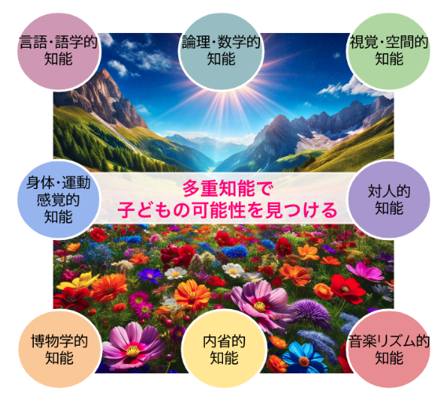

  

#### ご参加ありがとうございます🌈

 

#### QRコードから ご参加頂くと、 手元でスライドが 見れます。 👉

    

<!-- 右側にチラシ画像-->

---

# 📋 本日の流れ

| 時間帯 | 内容 |
|---|---|
| <big>13:30〜13:45</big> | <big>ー 第 1️⃣ 部 ー　　子どものことを理解する</big>|
| <big>13:45〜14:00</big> | <big>ー 第 2️⃣ 部 ー　　子どもの自信とやる気を育む</big> |
| <big>15:05〜15:20</big> | <big>まとめ・ふりかえり</big>

---

# 🎯今日の目的

#### ⚪︎子どものことを理解する

 

#### ⚪︎子どもの自信と 　　　　　やる気を育む

       

---

# 🎯今日の目的

#### ⚪︎子どものことを理解する
##### **【前半】**
- ### 「困った行動」の背景を一緒に考える
- ### 脳の仕組みを学ぶ 

#### ⚪︎子どもの自信と 　　　　　やる気を育む
##### **【後半】**

- 学びの環境づくりを知る

 

---

## 今日のゴール

     

---

## 🟠 グループワーク（5分間）
### 最近ちょっとイライラしたことありますか？

- 宿題しない
- 朝起きない
- 準備しない
- 兄弟げんかが止まらない

---

# ② 理解編  
## 🧠 感情のしくみと脳のつくり

---

## 🧠 脳の3層構造

| 脳の層 | 機能 | 子どもの反応 |
|--------|------|---------------|
| 🐊 爬虫類脳 | 防衛・命を守る | 黙る・逃げる・怒鳴る |
| 🐶 哺乳類脳 | 感情・共感 | 泣く・甘える・甘える |
| 🧠 人間脳 | 思考・言語 | 学ぶ・話す・整理する |

> 💡 イライラは「防衛モード」から始まる

---

# ✋ ワーク  
## 親自身の「爬虫類脳」体験を振り返ろう

- 朝のバタバタ
- 急いでる時の子どもののんびり
- 兄弟ゲンカ……

### 👥 感情のスイッチ、どうしたら切り替わった？

---

# ③ 実践編  
## 子どもの「怒り」「やらない」行動の背景

---

## 🧠 なっとくのりくつ

| ステップ | 内容 | 宿題の例 |
|----------|------|------------|
| ① | できごと整理 | 漢字がわからなかった |
| ② | 気持ちの整理 | 不安・イライラした |
| ③ | 身体反応 | 胃が痛くなった |
| ④ | 他の行動 | タイマーを使う／先生に聞く |
| ⑤ | 次への合意 | 音読→漢字にしよう！ |

---

## 🧠 認知特性：同時処理 vs 継次処理

| 特性 | 合う学び方 | 苦手な方法 |
|------|-------------|-------------|
| 同時処理型 | 図・イメージ・全体地図 | 順番説明のみ |
| 継次処理型 | 手順・音読・一つずつ | 複雑な図解 |

---

## ✋ ワーク：うちの子はどっち？

- 📄 図で理解する？  
- 🧾 順番で理解する？

### → 合った方法で工夫した例をグループで共有

---

# 🧠 まとめ：ここまでの気づき

- イライラは防衛モード（爬虫類脳）
- 感情のラベリングが大切
- 認知特性に合う学び方で“やる気”が変わる

---

# ④ エリクソンと有能感

## ✨ 有能感は「やれた」経験で育つ

- 周りと比べて劣等感を持ちやすい時期
- 逆に「できた！」があれば、自信に

---

# ⑤ 多重知能理論（MI）

## 🌈 8つの知能で“好き”を伸ばす！

| 知能タイプ | 例 |
|------------|-----|
| 音楽 | リズム、歌、楽器 |
| 身体 | ダンス、スポーツ |
| 対人 | 会話、グループ |
| 言語 | 話す、書く、読む |
| 数理 | パズル、計算 |
| 自然 | 植物、動物 |
| 空間 | 絵、デザイン |
| 内省 | 自分を知る力 |

---

# ✋ ワーク：  
## 子どもの“好き”から知能タイプを探そう

---

# ⑥ 年間行事 × 多重知能MAP

### 📅 学校の1年＝子どもが光るステージ！

- 4月：入学式（対人・言語）  
- 5月：遠足（身体・自然）  
- 6月：プール開き（身体）  
- 7月：個人面談（内省）  
- 11月：産業教育フェア（数理・対人）  
- ……など

---

# ⑦ ふりかえり＆まとめ

### 📌 今日の気づき  
- 脳・感情・認知のしくみがわかると見方が変わる  
- 勉強やイライラは「特性と環境」の組み合わせで見直せる  
- 「この子はどこで光るか？」という目で見ると、育て方が変わる！

---

# 明日からできる3つのステップ

 

#### ① 🧠 脳と心が安全だと感じられる環境を整える
 

#### ② 💬 子どもがやり遂げることをサポートしてあげる
 

#### ③ 🌈 その子ならではの強み・得意・賢さを生かすサポート

---

<!-- _header: "" -->
<!-- _footer: "" -->

# さいごに💐

 

## 私たち大人ができるのは、  “評価” することではなく ”ご縁をつなげる” こと。

#### 「その子の個性を光らせる体験との出会いはなんでしょう？」

## 子どもの味方となって、可能性に目を向けていきましょう🌱  ありがとうございました。

 琉球のタネ  ひとり一人の「好き」「得意」が社会とつながる

---

#### 🎤 次は子どもの行動を促す言葉かけのプロ、 
#### 　長嶺克先生のペップトークをお楽しみください！

---

# 【前半】子どものことを理解する
- #### 「困った行動」の背景を一緒に考える
- #### 脳の仕組みを学ぶ 

---

## よくある“困った行動”

- 宿題をしない・先送りにする
- 兄弟げんかが絶えない
- ちょっとしたことで怒る・泣く
- 指示を聞かない・逃げる

---

## 行動は「見えている氷山の一角」

- 子どもの行動は「出力」
- その背景には「感覚」「思考」「感情」がある
- 行動→意味づけせず → 背景を“見立てる”

---

## 🧠 脳の三層構造（進化でできた順）

| 層 | 名称 | 主な役割 |
|----|------|----------|
| 第1層 | 爬虫類脳（脳幹） | 本能・反射（安全確保） |
| 第2層 | 哺乳類脳（辺縁系） | 感情・記憶・安心感 |
| 第3層 | 人間脳（大脳新皮質） | 理性・言語・自己制御 |

➡ 子どもは「人間脳」がまだ育ち途中！  
まず「安心」が整ってから「学び」へ向かえる

---

## 🧠 神経心理ピラミッド（ルリアの脳機能モデル）

| レベル | 内容 | 子どもの様子（例） |
|--------|------|------------------|
| 入力（感覚・注意） | 感覚刺激を受け取る | 音や光に敏感／気が散る |
| 統合（記憶・理解） | 情報を整理する | 全体像がつかめない／焦る |
| 出力（行動・表現） | 行動として出す | 癇癪・回避・怒る・暴れる |

➡ 出力だけではなく、入力と統合から見立てるのが大切！

---

# 【後半】  
## 子どものやる気と自信を育てる環境づくり

---

子どものやる気と自信を育てる環境づくり

# 🧒 エリクソンの発達課題

######  **皆ができて自分ができない事があるとき** 「自分ができなくても皆ができるからいいや、どうせ自分なんて」と諦めや劣等感を持ってしまいそうになる。
######  逆に、周りの皆ができなくて**自分にしかできない事がある**と「もっと自分にできる事はないかな？」と**自分にできる事（有能感）** を探していきます。
######  「有能感」は  **「根気」や「粘り強さ」** を 形成し、一生の価値があります。
######  「勤勉性」は「できた」とか「やりとげた」といった達成感のことです。

---

# 🎨 多重知能理論（MI）とは？

💡「頭がいい」はひとつじゃない！

- 🗣 言語的知能（話す・書く）
- 🧮 論理数学的知能（計算・法則）
- 🎶 音楽的知能（音感・リズム）
- 🕺 身体運動的知能（運動・手先）
- 🖼 空間的知能（地図・図形）
- 🧍‍♀️ 対人的知能（人と関わる）
- 🧘 内省的知能（自分を見つめる）
- 🌿 博物的知能（自然・動植物）

---

---

## 子どもが力を発揮できる環境とは？

- 安心感がある（感情が落ち着いている）
- 役割がある（自分が役立っている）
